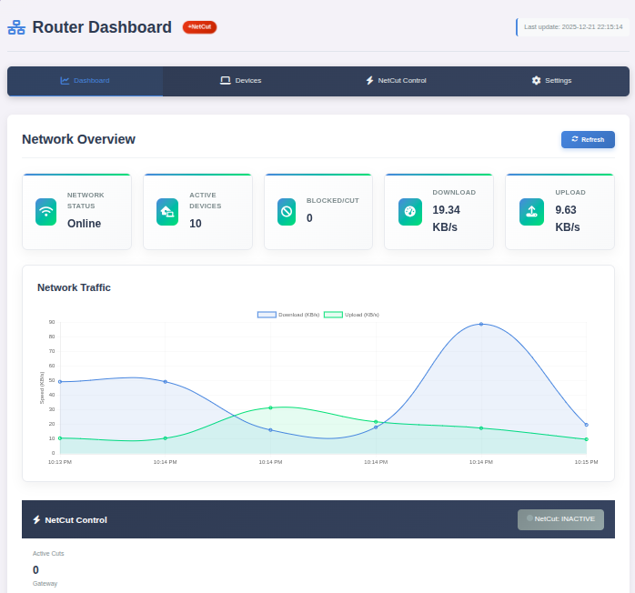
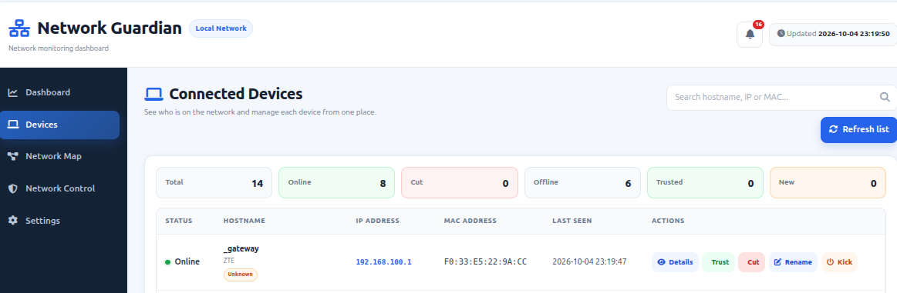
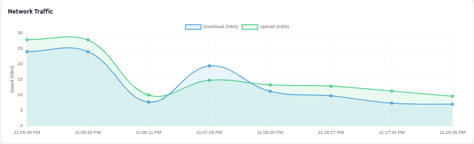
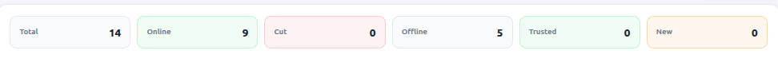
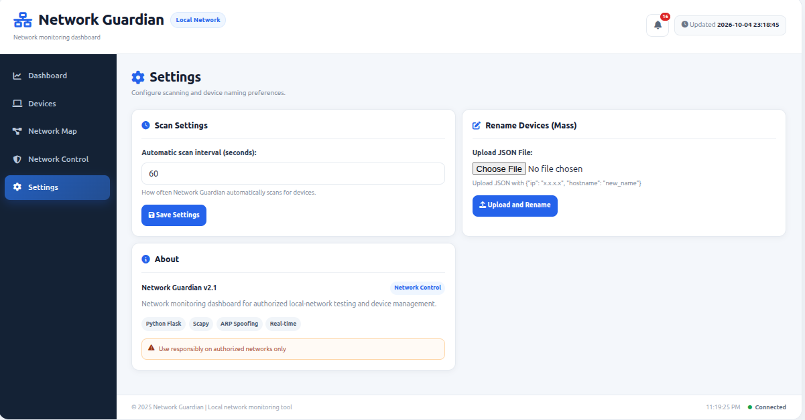
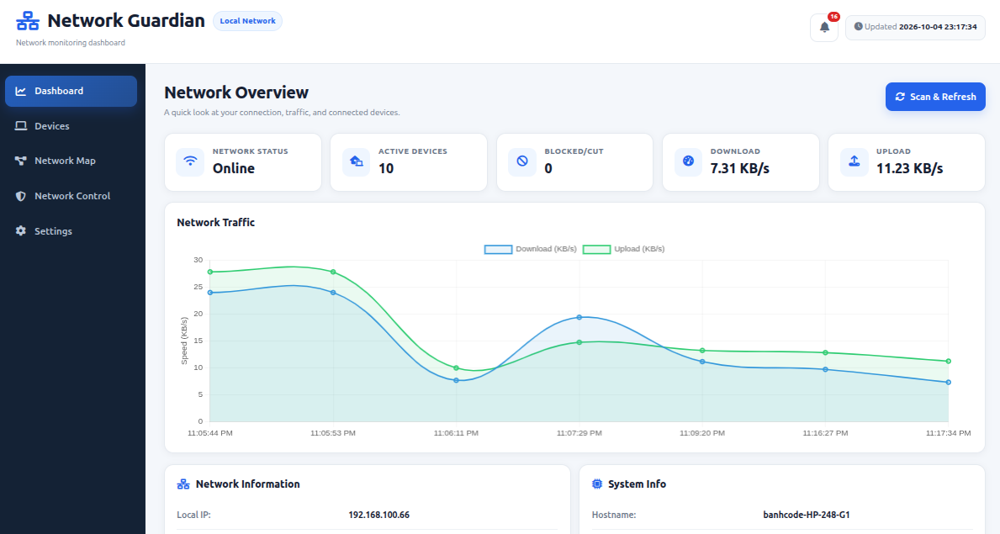
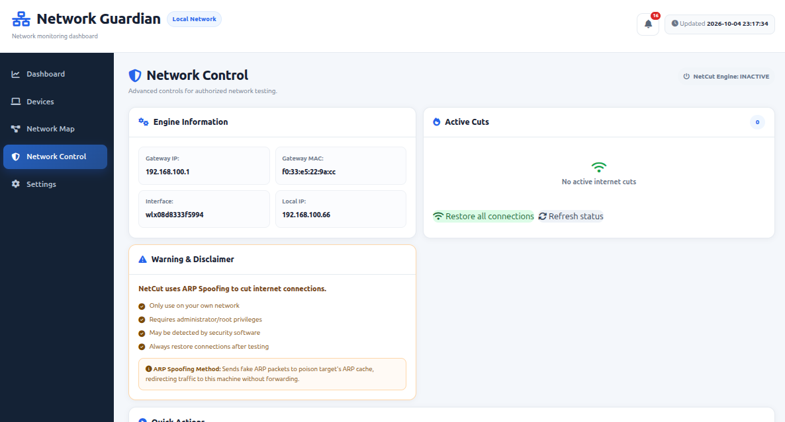

# 🌐 Network Guardian



**Network Guardian** is a Flask-based local-network monitoring dashboard designed for authorized network administration, troubleshooting, and lab/testing environments.

It discovers devices on the local network, displays network and system information, monitors traffic, and provides a web UI for device management and network-control testing.

> **Use only on networks you own or are explicitly authorized to monitor and manage.**

---

## ✨ What's New in the Latest UI/UX Refresh

The current version focuses on making the dashboard easier to understand and faster to use without changing the core scanning architecture.

### 🖥️ Dashboard

- Cleaner network overview
- Active-device and traffic statistics
- Improved status hierarchy
- Quick visibility into the current local-network state
- Notification center for device and network events

### 💻 Devices

- Search by hostname, IP, MAC address, vendor, or device type
- Online / offline / blocked status
- Trusted-device status
- Device detail panel opened directly from the IP address
- Device actions grouped more clearly
- Trusted and new-device counters

### 🔎 Device Details

Click an IP address to open a floating device-information panel containing, when available:

- Hostname
- IP address
- MAC address
- Vendor
- Device type
- Device role
- Last seen time
- Wi-Fi technology
- SSID
- Frequency
- Signal strength
- RX/TX Wi-Fi link rate
- Observed traffic rate
- Device activity history

### 🛡️ Trusted Devices

Devices can be marked as **Trusted** from the Devices page. Trusted status is stored in the browser using `localStorage`.

### 🔔 New Device Alerts & Notifications

When a device that has not been seen before appears in the dashboard, Network Guardian can create a notification such as:

- New device detected
- Device trusted / untrusted
- Device status changes
- Scan-related events

The notification center keeps a small local history and can be cleared from the UI.

### 🕒 Device History

Network Guardian records client status events in the browser so a device can show a simple timeline such as:

```text
First detected → Online → Offline → Online
```

This history is local to the browser and is not currently stored in a server database.

### 🗺️ Network Map

The Network Map provides a simple visual representation of the detected local network:

```text
                     🌐 Gateway
                         │
              ┌──────────┴──────────┐
              │                     │
          💻 This PC             📱 Client
                                
                                  └── 📺 Client
```

The map is a dashboard visualization based on detected devices. It does **not** represent the physical switch/AP topology unless that information is separately available.

### ⚙️ Settings

- Configure automatic scan interval
- Configure device naming preferences
- View application information

### 🌐 Network Control

The project includes experimental network-control functionality for authorized lab/testing scenarios, including restore and device connection-control operations.

Because these operations modify local network behavior, they should be treated as privileged administrative features.

---

## 📸 Screenshots

### Dashboard


### Devices



### Live Traffic



### System Information



### Settings



### Connected Clients



### Network Control



---

## 🧩 Core Architecture

The application is built around a Flask web server and a Linux-oriented network-management layer.

```text
Browser
   │
   ▼
Flask Dashboard
   │
   ├── Device Scanner
   │      ├── Nmap
   │      ├── ARP / Scapy
   │      ├── IP neighbor information
   │      └── Hostname / vendor detection
   │
   ├── Traffic & System Monitoring
   │      └── psutil
   │
   ├── Device Details
   │      ├── iw (when available)
   │      └── conntrack (when available)
   │
   └── Network Control
          ├── Scapy / ARP
          └── iptables
```

---

## 📁 Project Structure

```text
Network-Guardian/
│
├── app.py                         # Main Flask application
├── netcut_engine.py               # Additional NetCut engine implementation
├── router_scanner.py              # Standalone router/client scanner utility
├── test_cut.py                    # Manual NetCut testing helper
├── start_netcut.sh                # Linux launcher for privileged operation
├── requirements.txt               # Python dependencies
├── device_changes_*.json         # Saved device naming data
│
├── templates/
│   └── index.html                 # Main dashboard UI
│
├── static/
│   ├── css/
│   │   └── style.css              # Dashboard styling
│   └── js/
│       └── script.js              # Frontend logic and UI state
│
└── images/
    ├── images.png
    ├── devices.png
    ├── live_traffic.png
    ├── system_info.png
    ├── settings.png
    ├── connected_clients.png
    └── CutInform.png
```

> Note: the current application imports and uses the main `NetCutEngine` implementation defined in `app.py`. `netcut_engine.py` is kept as a separate implementation/utility file.

---

## 🛠️ Requirements

### Software

- Linux recommended (Ubuntu/Debian are the primary target)
- Python 3
- `pip`
- `nmap`
- `iptables`
- `iw` for best-effort Wi-Fi link information
- `conntrack` for best-effort per-device traffic observation

### Python packages

The project uses the versions pinned in `requirements.txt`:

```txt
Flask==2.3.3
Werkzeug==3.0.1
Jinja2==3.1.2
MarkupSafe==2.1.3
click==8.1.7
itsdangerous==2.1.2
python-nmap==0.7.1
scapy==2.5.0
netifaces==0.11.0
psutil==5.9.5
requests==2.31.0
urllib3==2.0.7
python-dotenv==1.0.0
colorama==0.4.6
tabulate==0.9.0
tqdm==4.66.1
```

Install the required system packages on Ubuntu/Debian:

```bash
sudo apt update
sudo apt install -y python3 python3-venv python3-pip nmap iptables iw conntrack
```

---

## 🐍 Virtual Environment (`.venv`)

Network Guardian should be run inside a Python virtual environment so its packages do not interfere with the system Python installation.

### Recommended: create `.venv` yourself

The safest and most portable method is to create the environment on the machine where you will run Network Guardian:

```bash
cd Network-Guardian
sudo apt install -y python3-venv python3-pip
python3 -m venv .venv
source .venv/bin/activate
python -m pip install --upgrade pip
pip install -r requirements.txt
```

Verify it with:

```bash
which python
python --version
pip list
```

The `which python` command should point to something similar to:

```text
.../Network-Guardian/.venv/bin/python
```

### Using the provided `.venv` archive

A separate `Network-Guardian-venv.zip` archive is provided with the project materials as a **bootstrap/example environment**. It was created on Linux with Python 3.13.

> ⚠️ **Important:** a copied virtual environment is not guaranteed to work on another machine. Python version, OS libraries, architecture, absolute paths, and compiled Python packages can differ. The provided archive should therefore **not** be treated as a universal pre-installed dependency bundle. Creating `.venv` locally and installing `requirements.txt` is the recommended method.

To extract the archive, place `Network-Guardian-venv.zip` beside the project and run:

```bash
unzip Network-Guardian-venv.zip
```

Before using a copied environment, check:

```bash
.venv/bin/python --version
.venv/bin/pip list
```

If the environment does not work correctly, remove it and recreate it locally:

```bash
rm -rf .venv
python3 -m venv .venv
source .venv/bin/activate
pip install -r requirements.txt
```

### Activate and deactivate

Activate the environment:

```bash
source .venv/bin/activate
```

After activation, the shell prompt normally shows `(.venv)` at the beginning.

Exit the environment when finished:

```bash
deactivate
```

### Run without activating

You can also directly call the Python executable inside the environment:

```bash
.venv/bin/python app.py
```

This is useful for scripts, launchers, or systemd-style execution where shell activation is inconvenient.

---

## 🚀 Installation

### 1. Clone the repository

```bash
git clone https://github.com/BlackCat-443/Network-Guardian.git
cd Network-Guardian
```

### 2. Create and activate `.venv`

```bash
python3 -m venv .venv
source .venv/bin/activate
```

### 3. Install Python dependencies

```bash
python -m pip install --upgrade pip
pip install -r requirements.txt
```

### 4. Start the dashboard

For normal dashboard/scanning use:

```bash
python3 app.py
```

Some network-control features require root privileges. For the project launcher:

```bash
sudo ./start_netcut.sh
sudo venv/bin/python app.py 

```

Make the launcher executable once if required:

```bash
chmod +x start_netcut.sh
```

### 5. Open the dashboard

```text
http://localhost:8888
```

From another device on the same authorized local network, use the host's LAN address shown by the application, for example:

```text
http://192.168.1.10:8888
```

---

## 🔍 Device Discovery

The scanner uses multiple local-network information sources and attempts to enrich device records with:

- IP address
- MAC address
- Hostname
- Vendor information
- Device type
- Gateway/local-device flags
- Last-seen information

Nmap is one of the core discovery tools, while Scapy and local system information are used for supporting network detection.

---

## 📡 Device Details: Wi-Fi & Speed

The Device Details panel distinguishes between **Wi-Fi link speed** and **internet speed**.

### Wi-Fi link speed

When Linux/AP station information is available through `iw`, the dashboard may show:

- Wi-Fi generation (for example Wi-Fi 4/5/6/6E/7 when detectable)
- Frequency
- Signal level
- RX link rate
- TX link rate

### Internet speed

A remote device's actual ISP speed cannot reliably be determined from its IP/MAC address alone. The dashboard therefore uses best-effort **observed traffic** where the host can measure it and clearly labels unavailable data rather than inventing a speed.

---

## 📊 Traffic Monitoring

Network Guardian collects system/network traffic information and exposes traffic history to the frontend.

The dashboard can display:

- Current download activity
- Current upload activity
- Historical traffic chart
- Device-level observed traffic when supported by the host

Per-device traffic is a best-effort observation and should not be interpreted as a guaranteed ISP throughput measurement.

---

## 🔔 Local UI Data

The latest UX features use browser `localStorage` for user-facing state such as:

```text
ng_trusted_devices_v1
ng_device_history_v1
ng_notifications_v1
```

This means:

- Trusted status is browser-local
- Device history is browser-local
- Notifications are browser-local
- Clearing browser site data removes this UI state
- The same data is not automatically shared between different browsers/devices

---

## 🔌 REST API

The current Flask application exposes endpoints including:

```text
GET  /
GET  /api/devices
GET  /api/device/<ip>/details
GET  /api/stats
GET  /api/hostname
GET  /api/traffic-history
GET  /api/scan
GET  /api/saved-devices
GET  /api/netcut/status
GET  /api/netcut/test
GET  /api/netcut/test-connection?ip=<ip>
GET  /api/netcut/flush-all

POST /api/block-device
POST /api/unblock-device
POST /api/kick-device
POST /api/rename-device
POST /api/rename-devices-mass
POST /api/update-settings
POST /api/netcut/cut
POST /api/netcut/restore
```

The API is intended for local application use and testing. It should not be exposed directly to the public internet.

---

## 🧪 Manual Testing

### Check the scanner

```bash
sudo .venv/bin/python -c "
import sys
sys.path.insert(0, '.')
from app import scan_fast

devices = scan_fast()

print(f'Found {len(devices)} devices')

for d in devices:
    print(
        f\"{d.get('ip', '--'):15} \\
{d.get('hostname', '--'):25} \\
{d.get('mac', '--')}\"
    )
"
```

### Check the ARP table

```bash
ip neigh
```

or, if available on your system:

```bash
arp -n
```

### Check the dashboard API

```bash
curl http://localhost:8888/api/devices
```

### Check a specific device's details

```bash
curl http://localhost:8888/api/device/192.168.1.100/details
```

Replace the example IP with a device detected on your authorized network.

---

## ⚠️ Security & Operational Notes

Network Guardian performs operations that can affect local network connectivity.

### Run only on authorized networks

Do not use the tool against networks, devices, or users without permission.

### Virtual environment compatibility

Do not commit or redistribute a machine-specific `.venv` as if it were portable. Recreate it with `python3 -m venv .venv` on the target machine and install from `requirements.txt`.

### Root privileges

Device-control functionality can require root privileges because the application uses low-level networking tools and firewall configuration.

### Firewall state

The current project contains emergency reset functionality that can flush `iptables` rules. Do **not** run the reset function on a host whose firewall configuration must be preserved unless you understand the consequences.

### Flask debug mode

The current development configuration runs Flask with debug mode enabled. This is suitable for development/testing only and should not be exposed to an untrusted network.

Before production use, disable debug mode and add proper authentication/authorization.

### Network Control

Network-control features should be treated as experimental administrative functionality. Test them in a controlled lab environment before using them on an important network.

---

## 🧭 Roadmap

Planned improvements can include:

- [ ] Authentication and role-based access control
- [ ] Safer firewall state management
- [ ] Persistent database for devices/history
- [ ] Server-side trusted-device management
- [ ] More accurate access-point/station information
- [ ] Better scan concurrency control
- [ ] Network topology discovery beyond simple client visualization
- [ ] Export device lists and traffic reports
- [ ] Production deployment configuration
- [ ] Improved test coverage

---

## 📝 Changelog

### 2026-10-04 — UI/UX Feature Refresh

- Added floating Device Details panel
- Added device information and best-effort Wi-Fi details
- Added observed per-device traffic information where available
- Added Trusted Devices
- Added New Device notifications
- Added notification center
- Added local device history timeline
- Added Network Map visualization
- Improved device search and filtering
- Added Trusted / New device counters
- Improved responsive layout and dashboard information hierarchy
- Updated wording and documentation to reflect the current UI

---

## 👨‍💻 Author

**Banh_Code**

Network Guardian is developed as a learning, monitoring, and authorized local-network administration project.

GitHub: [BlackCat-443/Network-Guardian](https://github.com/BlackCat-443/Network-Guardian)

---

## 📄 License

This repository is intended to use the **MIT License**.

If the repository does not yet contain a `LICENSE` file, add the standard MIT License text before publishing a release that formally claims the license.

---

## ⭐ Support the Project

If Network Guardian helps you learn about networking, Flask, Linux networking, or system monitoring, consider starring the repository and contributing improvements.
